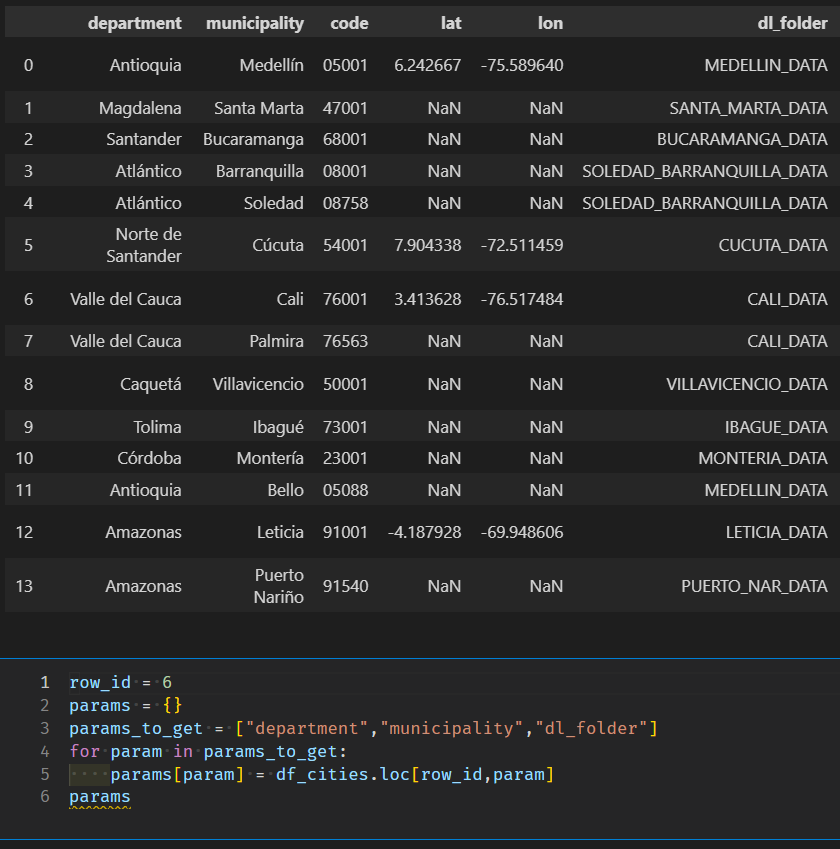
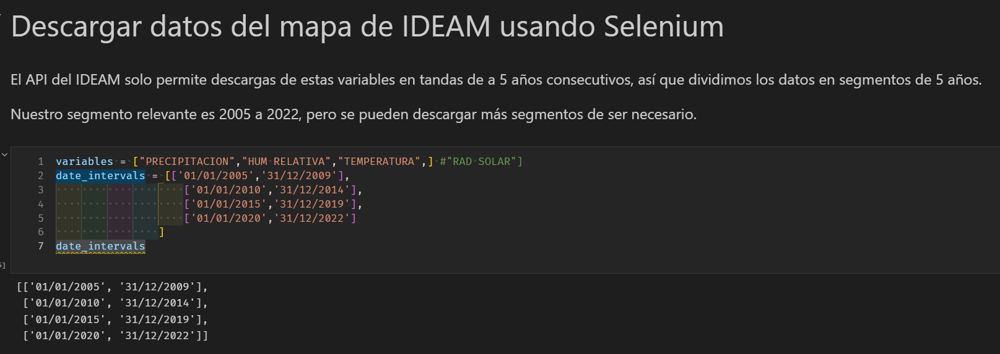
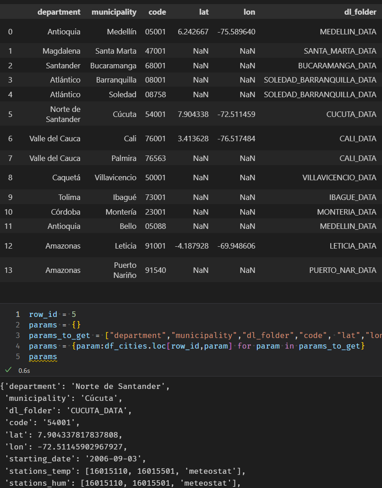
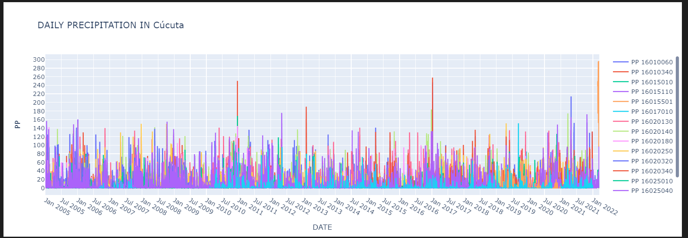
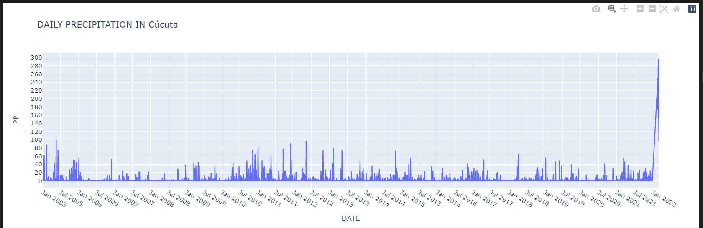
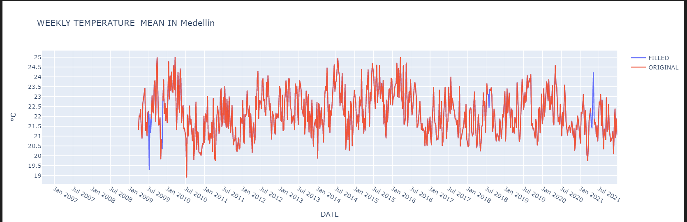
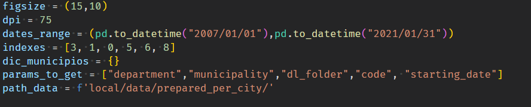

# Analítica de datos climáticos y casos de Dengue en Colombia: manual del repositorio


Tabla de contenidos:
- [Analítica de datos climáticos y casos de Dengue en Colombia: manual del repositorio](#analítica-de-datos-climáticos-y-casos-de-dengue-en-colombia-manual-del-repositorio)
  - [Instalación de dependencias](#instalación-de-dependencias)
  - [Estructura del proyecto](#estructura-del-proyecto)
- [Instrucciones de uso](#instrucciones-de-uso)
  - [Preparación](#preparación)
  - [Cuaderno 1: descarga de datos](#cuaderno-1-descarga-de-datos)
    - [Selección de la ciudad](#selección-de-la-ciudad)
    - [API IDEAM](#api-ideam)
    - [API Datos Abiertos](#api-datos-abiertos)
    - [Fin del cuaderno](#fin-del-cuaderno)
  - [Cuaderno 2: pre-procesamiento de datos de Dengue](#cuaderno-2-pre-procesamiento-de-datos-de-dengue)
  - [Cuaderno 3: pre-procesamiento de datos climáticos](#cuaderno-3-pre-procesamiento-de-datos-climáticos)
    - [Selección de ciudad](#selección-de-ciudad)
    - [Selección de estaciones y generación de series de tiempo](#selección-de-estaciones-y-generación-de-series-de-tiempo)
    - [Procesamiento de datos faltantes:](#procesamiento-de-datos-faltantes)
    - [Guardar los datos:](#guardar-los-datos)
  - [Cuaderno 4: visualización de datos a nivel país](#cuaderno-4-visualización-de-datos-a-nivel-país)
  - [Cuaderno 5: visualización de datos a nivel ciudad](#cuaderno-5-visualización-de-datos-a-nivel-ciudad)
  - [Notas finales:](#notas-finales)

##

Este repositorio contiene una serie de cuadernos de Jupyter y una serie de scripts que permiten la obtención de datos de climatología y de dengue (casos y muertes). A continuación se facilitan las instrucciones para el uso de los cuadernos.

Nota 1: la obtención de los datos climáticos depende de tres (3) fuentes, entre las que se incluyen el aplicativo DHIME del IDEAM, la API de datos abiertos del gobierno colombiano, y la API de la librería Meteostat. Según el caso y la ubicación, varias de estas fuentes pueden arrojar datos ruidosos, por lo que es importante aclarar que el producto final de datos para una ubicación específica requiere combinar datos de varias fuentes, un proceso que requiere la intervención de un usuario.

Nota 2: la obtención de los datos del virus del Dengue depende de una única fuente, la plataforma web del SIVIGILA. Dicho instituto no maneja un formato consistente para sus datos posteriores a 2018, por lo que se ha hecho necesario modificar las rutinas para la manipulación de los datos de los años 2019, 2020 y 2021. Es por tanto de esperar que para los datos del año 2022 sea necesario modificar una vez más las rutinas.


## Instalación de dependencias

Los cuadernos han sido probados en los sistemas operativos Linux y Windows, pero no en MacOS. Se recomienda, en todo caso, utilizar un entorno Linux.

Para el manejo de dependencias se hace uso del software Anaconda, que puede instalarse fácilmente siguiendo las instrucciones disponibles en su [sitio web](https://www.anaconda.com/download/).

Las dependencias para ambos sistemas operativos se encuentran en el archivo ```env.yml```, y deben instalarse con el siguiente comando:

```bash
conda env create -f env.yml
```

Este comando genera un ambiente virtual con las librerías necesarias. Por defecto, el nombre del ambiente es ```dengue```, pero este puede modificarse en la primera línea del archivo si es necesario.

Además de lo anterior debe instalarse una versión reciente de Google Chrome y el ejecutable chromedriver que le corresponda a dicha versión debe colocarse en la raiz del repositorio. Chromedriver se puede descargar desde el [siguiente enlace](https://chromedriver.chromium.org/downloads), mientras que la versión de Chrome se puede consultar en el menú de ```Ayuda > Acerca de``` del navegador


## Estructura del proyecto

El proyecto consta de cinco (5) cuadernos principales y una serie de modulos que encapsulan ciertas funcionalidades relacionadas con la descarga de los datos, el preprocesamiento, el manejo de las series de tiempo y la visualización. En este manual nos enfocaremos únicamente en los cuadernos.

# Instrucciones de uso

## Preparación

Antes de comenzar a descargar los datos debe prepararse un archivo ```params.csv``` que contenga la información de las ciudades o localidades para las que se desee descargar datos. La información debe contar con las siguientes columnas:

```csv
department,municipality,code,lat,lon,dl_folder,starting_date,stations_temp,stations_hum,stations_prec,stations_rad,range_temp,range_hum
Valle del Cauca,Cali,76001,3.4136282825278563, -76.51748445057298,CALI_DATA,2006-11-24,"[26085170, 'meteostat',26055120]","[26085170,'meteostat', 26055120]","[26055120, 26080310, 26085170]",[],"[16.5, 45]","[30, 99.99]"

```

Por defecto, el cuaderno incluye información sobre varias ciudades, pero hace falta añadir información de coordenadas para varias de ellas.

|Columna|Descripción|Ejemplo|
|---|---|---|
|department|El departamento en el que se encuentra la ciudad|Valle del Cauca|
|municipality|La ciudad para la que se desean obtener los datos|Cali|
|code|El código asignado por la DIAN a la ciudad. Debe incluir ceros al inicio de haberlos.|76001|
|lat|La latitud de la ciudad|3.4136282825278563|
|lon|La longitud de la ciudad|-76.51748445057298|
|dl_folder|El nombre del directorio en el que se almacenarán los datos descargados*|CALI_DATA|
|starting_date|La fecha de inicio de los datos a descargar. Debe ser una fecha válida para el formato de fecha de datos descargado**.|2006-11-24|
|stations_temp|La lista de estaciones de temperatura a incluir al generar la serie de tiempo agregada\*\*\*|"[26085170, 'meteostat',26055120]"|
|stations_hum|La lista de estaciones de humedad a incluir al generar la serie de tiempo agregada\*\*\*|"[26085170,'meteostat', 26055120]"|
|stations_prec|La lista de estaciones de precipitación a incluir al generar la serie de tiempo agregada\*\*\*|"[26055120, 26080310, 26085170]"|
|stations_rad|La lista de estaciones de radiación a incluir al generar la serie de tiempo agregada\*\*\*|"[]"|
|range_temp|El rango de temperatura a incluir en la serie de tiempo agregada|"[16.5, 45]"|
|range_hum|El rango de humedad a incluir en la serie de tiempo agregada|"[30, 99.99]"|

\* Nota: el nombre de la carpeta puede ser el mismo para varias localidades, en caso de que se quieran fusionar datos de varias ciudades cercanas. Por ej.: Soledad y Barranquilla llevarían el mismo nombre en el campo ```dl_folder```.

\*\* Nota: en ocasiones, es necesario modificar la fecha inicial para eliminar datos ruidosos u omitir huecos en las series de tiempo.

\*\*\* Nota: la lista de estaciones se establece de manera manual durante la ejecución de los cuadernos y se guarda de forma automática en el archivo ```params.csv```. Salvo que se sepa de antemano qué estaciones se desea utilizar, este campo se debe dejar con corchetes vacíos: ```[]```.


## Cuaderno 1: descarga de datos

El cuaderno 1 consta de varias celdas que deben ejecutarse para descargra los datos. Por defecto, los datos quedan almacenados en la carpeta ```local/data```, es decir que no se sincronizan con el repositorio de GitHub.

### Selección de la ciudad

La lista de ciudades para las que hay parámetros preparados se encuentra en la celda número 6 del cuaderno. Esta celda muestra la lista de ciudades con sus respectivos parámetros. La ciudad se puede escoger en la celda número 7 del repo al poblar la variable ```row_id``` con el número de línea correspondiente a la ciudad. En el ejemplo que se muestra debajo se escoge la ciudad de Cali al usar el identificador de fila 6:



### API IDEAM

Para descargar datos con la API del IDEAM es necesario establecer intervalos de 5 años como se describe abajo. Debido a esto y a la lentitud del proceso de <i>web scrapping</i>, el proceso de descarga de datos del IDEAM puede tomar entre 20 y 60 minutos por ciudad.




### API Datos Abiertos

La API de datos abiertos es mucho más rápida y no necesita establecer intervalos para la descarga de datos.


### Fin del cuaderno

Una vez descargados los datos necesarios, se puede acceder a los mismos en la carpeta ```./local/data```. Sin embargo, se recomienda pasar al siguiente cuaderno para procesarlos.


## Cuaderno 2: pre-procesamiento de datos de Dengue

El segundo cuaderno puede utilizarse sin problemas tras haber utilizado el primer cuaderno. Solo es necesario ejecutar todas las celdas y esperar. A grandes rasgos, este cuaderno sencillamente procesa los datos descargados en el cuaderno 1 y los convierte a formato semanal para cada municipio del país.


## Cuaderno 3: pre-procesamiento de datos climáticos

El tercer cuaderno abarca todo el procesamiento a realizar sobre los datos climáticos. Este cuaderno requiere intervención del usuario para seleccionar la ciudad cuyos datos se van a preprocesar y las mejores estaciones de las cuales extraer datos.

### Selección de ciudad

Como en el pantallazo mostrado abajo, se debe seleccionar una de las ciudades disponibles en el archivo ```params.csv```.



### Selección de estaciones y generación de series de tiempo

Al procesar los datos de precipitación, temperatura y humedad se puede visualizar las series de tiempo para cada estación que devolvieron los datos:



El usuario puede activar o desactivar series de tiempo haciendo clic en las estaciones. Esta es una labor manual que requiere verificar más arriba la altura y coordenadas de cada estación a fin de seleccionar las mejores.

En la celda que se muestra a continuación se pueden seleccionar manualmente las estaciones. Una vez seleccionadas por primera vez, estas quedan registradas en el archivo ```params.csv```. En caso de que se quiera modificar la lista de estaciones, se debe vaciar el campo correspondiente en el archivo ```params.csv``` y volver a ejecutar el cuaderno.

Luego de esto, se puede visualizar la serie de tiempo agregada:



En este caso observamos que la serie de tiempo tiene un pico extremo hacia el final, que debe verificarse manualmente iniciando el proceso desde 0. En cualquier caso, se sigue el mismo procedimiento para los datos de temperatura y humedad. La mayor diferencia es que para dichos cuadernos se pueden eliminar las observaciones ruidosas con el campo ```temperature_range``` de ```params.csv```, que elimina todas las observaciones horarias o minutales que se encuentren por fuera de cierto rango (por ejemplo, temperaturas menores a 10 grados en Barranquilla). De nuevo, si se detectan dichas anomalías, deben consignarse en el archivo de parámetros y se debe ejecutar el cuaderno desde el comienzo.

### Procesamiento de datos faltantes:

Los datos faltantes se procesan utilizando interpolación de datos a nivel anual y semanal. Es decir, si se quiere llenar un dato faltante en la semana 12 del año 2019, se usan los datos de la semana 13, la semana 11 y la semana 12 en los años anterior y posterior para obtener un promedio más confiable. Este proceso es automático.

### Guardar los datos:

Tras los pasos anteriores, solo se hace necesario ejecutar el resto de celdas. Cerca del final del cuaderno se podrá visualizar una gráfica interactiva de los datos tras llenar los huecos que hubiese sido necesario llenar (azul):



En cualquier caso, los datos quedarán guardados en la carpeta ```.local/data/prepared_per_city```.


## Cuaderno 4: visualización de datos a nivel país

Este cuaderno permite al usuario utilizar los datos establecidos anteriormente para generar gráficas y mapas de la situación del Dengue en el país. Al igual que el cuaderno 2, solo deben ejecutarse las celdas.

## Cuaderno 5: visualización de datos a nivel ciudad

Este cuaderno permite visualizar la situación del Dengue y las  tendencias climáticas para las ciudades de cuyos datos se disponga. La ejecución de las celdas no requiere mayor manipulación, aunque se recomienda visualizar los datos en tandas de a 6 ciudades para poder hacer comparaciones adecuadas. Dicha selección se puede hacer en la siguiente celda, con la variable ```indexes```:





## Notas finales:

Hay 5 cuadernos adicionales que no se describen en este manual. El motivo es que dichos cuadernos hacen referencia a la conversión de los datos para su ingreso en una base de datos SQL y para tareas predictivas básicas que no hacen parte del alcance de este objetivo.

En caso de encontrar algún error, por favor abrir un <i>issue</i> en el repositorio de GitHub: https://github.com/alceballosa/dengue-project/issues.

En caso de hacer modificaciones importantes al código, puede hacer un <i>pull request</i> para integrarlas o notificar los cambios al desarrollador para discutir cómo integrarlos.